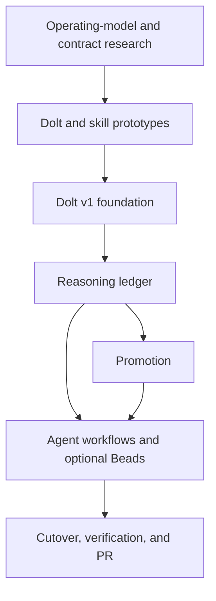

# Beadcrumbs as a Repository-Local Reasoning Ledger

**Date**: 2026-08-27

**Status**: Approved direction; implementation follows the dependency graph below

**Wayfinder map**: [Chart the greenfield Beadcrumbs reasoning ledger](beads:bdc-7ah)

**Release target**: v1.0.0 candidate

---

## Objective

Rebuild Beadcrumbs as a standalone, task-tracker-neutral ledger for the durable
reasoning behind software work.

Beadcrumbs records compact, attributable knowledge: captured fragments,
synthesis operations, insights, evidence, provenance, validation, authority,
causal references, promotion proposals, and promotion receipts. A task tracker
may be referenced or enriched through a supported adapter, but it is not the
owner of Beadcrumbs data.

The product boundary is:

> Task trackers coordinate work. Beadcrumbs preserves the evidence, intent, and
> evolving understanding behind that work.

This is a clean-break redesign. The current SQLite and JSONL implementation is
an unused prototype, not a compatibility contract. The new product uses an
independent repository-local Dolt database and does not import or migrate the
prototype store.

## Outcomes

The first release provides:

1. Repository-local Dolt storage that works coherently from linked Git
   worktrees, including Git-invisible stealth mode.
2. Reusable Crumbs with provenance, numeric confidence, redaction, and append-
   only human or agent review.
3. Attributable Harvest operations that synthesize selected Crumbs into
   revisioned Insights without consuming those Crumbs.
4. A tracker-neutral, typed reference graph with semantic relations and
   adapter-owned opaque locators.
5. Evidence, validation, invalidation, supersession, and authority that remain
   distinct rather than collapsing into one status field.
6. Independent, idempotent Promotion Proposals, attempts, rejections, and
   receipts for generic durable-knowledge destinations.
7. Bounded `context`, `handoff`, and `prime` output for humans and agents.
8. Stable machine-readable JSON for every command that participates in agent
   workflows.
9. A portable Beadcrumbs skill installable through the open Vercel Skills
   installer, with explicit CLI commands as its cross-agent contract.
10. Optional Beads enrichment through supported `bd --json` commands, without
    reading or sharing Beads' Dolt database.

## Non-goals

- Task lifecycle, dependency scheduling, claiming, or ready-work selection.
- Raw transcript storage or private chain-of-thought capture.
- SQLite or JSONL compatibility, migration, or dual-write support.
- A concrete Project OS, Linear, Slack, or GitHub destination adapter.
- Cross-project aggregation or a global knowledge database.
- Direct access to a task tracker's internal database.
- Automatic deletion or expiry of captured knowledge.
- Mandatory agent authority over project policy.
- Windows support when the selected Dolt operating model cannot meet the same
  reliability contract as macOS and Linux.

## Domain Model

### Crumb

A **Crumb** is the smallest durable captured fragment. It contains compact
content, capture time, actor/model/session provenance, numeric confidence, and
its review history.

Crumb review state is one of:

- `candidate`
- `accepted`
- `rejected`

Selection and synthesis are relationships, not Crumb states. A Crumb remains
available to many Harvests and many Insights. Review and supersession append
events; they do not erase prior state.

### Harvest

A **Harvest** is an attributable batch synthesis operation over selected
Crumbs. Its inputs form a many-to-many relationship with Crumbs. A Harvest
records the initiating actor, model and session when applicable, policy and
redaction versions, timestamps, and outcome.

Harvesting persists redacted candidate Crumbs rather than raw transcripts or
unreviewed canonical Insights. Automatic harvesting is opt-in per repository
and should run during a session and near durable completion points such as PR
merge or close.

### Insight

An **Insight** is higher-order knowledge derived from one or more Crumbs. It has
revisioned content, derivation links, provenance, confidence, and review
events. Updating an Insight creates a new revision; invalidation and
supersession preserve the old revision and its lineage.

One Insight revision may produce many independent Promotions. A result at one
destination has no lifecycle effect on attempts at another destination.

### Reference

A **Reference** identifies something inside or outside Beadcrumbs. Its identity
consists of:

- adapter kind;
- adapter-owned opaque locator;
- optional repository or workspace identity;
- optional observed label and metadata cache.

References attach through semantic relations:

- `source`
- `evidence`
- `subject`
- `spawned-work`

The reference graph is tracker-neutral. Core tables and APIs do not contain
Beads-, Linear-, GitHub-, or Project-OS-specific columns. Adapters parse and
resolve their own locators.

### Evidence, confidence, validation, and authority

These concepts remain independent:

- **Evidence** is a typed reference supporting or challenging a record.
- **Confidence** is the author's numeric self-assessment, constrained to
  $0 \leq confidence \leq 1$.
- **Validation** is an append-only review event with actor, verdict, rationale,
  evidence, and timestamp.
- **Authority** describes what an actor's decision may establish for a
  destination or scope.

Agents may create visible, usable records and may grant a working default when
the configured authority policy permits it. Every such action records
actor/model/session provenance. Humans can later confirm, reject, invalidate,
or supersede it. Human approval is required only where destination policy
explicitly requires human authority.

### Promotion Proposal and Receipt

A **Promotion Proposal** is a structured request to turn one Insight revision
into one durable destination record. It includes:

- Insight and revision;
- semantic destination class;
- proposed content;
- supporting Crumbs and evidence;
- confidence and provenance;
- requested authority;
- canonical content hash.

A **Promotion** is one independent attempt to apply a proposal. Its idempotency
key is derived from the Insight revision, destination identity, and canonical
proposal content. Retries append attempts against the same logical proposal.

A **Promotion Receipt** is the attributable link to a successful external
result. Failure, rejection, supersession, or review is append-only and affects
only that proposal and destination.

Destination classes describe semantic force rather than filesystem layout.
The generic model must cover learnings, memories, decisions, ADRs, policies,
lexicon terms, business or technical ontology records, mappings, and future
knowledge types without assuming one Project OS implementation.

## System Boundaries

### Ledger module

The ledger is the deep behavioral module. Command handlers express intent
through use-case APIs rather than issuing SQL or manipulating generic rows.
The module owns:

- lifecycle invariants;
- append-only event behavior;
- idempotency;
- reference semantics;
- provenance requirements;
- policy decisions;
- transaction boundaries;
- stable result and error types.

Its storage port reflects domain operations such as capturing a Crumb,
reviewing a record, completing a Harvest, revising an Insight, and recording a
Promotion attempt. It is not a generic CRUD interface.

### Dolt storage module

The storage module owns repository discovery, initialization, connection
lifecycle, transactions, schema migrations, concurrency behavior, backup,
restore, and recovery.

The preferred operating model is embedded Dolt by default, subject to a
disposable proof against current primary-source documentation. The proof must
choose one supported model for v1 rather than shipping several partially
supported modes.

Beadcrumbs' database is independent from Beads' database even when both use
Dolt. Git identity identifies the repository workspace. Tracker identities are
external References.

### Normalized schema

The implementation should begin from normalized tables equivalent to:

- `crumbs`
- `crumb_review_events`
- `harvests`
- `harvest_inputs`
- `insights`
- `insight_revisions`
- `insight_derivations`
- `references`
- typed record-to-reference links
- `validation_events`
- `authority_events`
- `promotion_proposals`
- `promotion_attempts`
- `promotion_receipts`
- schema and policy metadata

The schema prototype decides exact columns and typed join-table boundaries.
Foreign keys, uniqueness constraints, and transaction-level invariants should
carry rules that the database can enforce. Behavioral APIs remain the only
supported application boundary.

### Optional Beads adapter

Beads is optional. Its adapter:

1. Detects availability without making core commands fail.
2. Uses supported non-interactive `bd --json` commands.
3. Stores the returned issue locator as an opaque external Reference.
4. Enriches labels and status on demand with explicit freshness metadata.
5. Degrades to the stored Reference when Beads is absent or unavailable.

Beadcrumbs never queries Beads' Dolt tables and never makes Beads a storage
dependency.

### Portable skill

The Beadcrumbs repository owns one generic skill distributed through the open
Skills installer. Explicit `bdc` commands and stable JSON are the portable
contract. Agent-specific hooks may improve session start, harvest timing,
compaction, handoff, or close behavior, but the core workflow remains usable
without those hooks.

The first release contains an extension seam for destination adapters and no
concrete Project OS adapter. Future destination designs are generic research
artifacts, not Hyptrain-specific code.

## CLI Contract

The first-release command surface is:

```text
bdc init [--stealth]
bdc capture
bdc crumb list|show|review
bdc harvest
bdc insight list|show
bdc reference add|list
bdc promote propose|record|reject
bdc context
bdc handoff
bdc prime
bdc doctor
```

Every command used by an agent supports stable JSON with:

- a versioned envelope;
- stable identifiers and timestamps;
- structured warnings and errors;
- deterministic field meanings;
- non-zero exit status for failed requested operations;
- no incidental prose mixed into JSON output.

Narrative output belongs in `context`, `handoff`, lineage views, and human
rendering of records. The first release defers the old external adapters,
generic import/export, and suggest-only task spawning.

## Privacy and Retention

Privacy is enforced before persistence:

1. Automatic harvesting is disabled until a repository opts in.
2. Candidate extraction operates on bounded session material.
3. Secret and sensitive-data detection runs before any Dolt write.
4. Redacted candidate Crumbs are persisted; raw transcripts are not.
5. Policy and redaction versions are recorded with the result.
6. Hostile input cannot turn quoted content into executable instructions.
7. External promotion renders from reviewed structured records, not raw input.

Candidate Crumbs remain until reviewed or explicitly pruned. Beadcrumbs does
not impose expiry or deletion policy; users and downstream systems own those
decisions.

## Dependency-Aware Implementation Plan

### Gate 0: Resolve evidence-bearing decisions

Complete these in parallel where possible:

1. Prove the standalone Dolt operating model across repository root, linked Git
   worktrees, stealth discovery, concurrent agents, interrupted writes, backup,
   restore, recovery, and supported platforms.
2. Verify Skills installer behavior and session integration across major agent
   environments, separating portable CLI behavior from optional hooks.
3. Research the generic durable-knowledge destination model and its
   provenance, freshness, review, supersession, and authority requirements.
4. Verify the optional Beads contract against supported `bd --json` behavior.

**Exit criterion:** each research ticket has a linked artifact, reproducible
evidence, a chosen direction, and a resolution recorded on the Wayfinder map.

### Gate 1: Prove the two risky seams

Build disposable prototypes for:

1. The chosen Dolt schema and deep storage interface.
2. The generic harvest-and-promote skill workflow.

Exercise real concurrency, interruption, idempotent retries, redaction, and
missing optional integrations rather than only happy-path examples.

**Exit criterion:** the chosen shapes survive adversarial review, and prototype
findings are incorporated into this design or a superseding implementation
specification.

### Phase 1: Establish the v1 foundation

1. Set the clean-break version and remove prototype compatibility promises.
2. Implement repository discovery, `init`, stealth configuration, schema
   versioning, and `doctor`.
3. Implement the normalized Dolt schema and transactional storage operations.
4. Add backup, restore, and interrupted-write recovery workflows.
5. Lock stable IDs, timestamps, JSON envelopes, and typed errors.

### Phase 2: Implement the reasoning ledger

1. Implement Crumb capture, provenance, confidence, review, and pruning.
2. Implement the typed reference graph and causal relations.
3. Implement Harvest inputs, completion, and failure behavior.
4. Implement Insight derivation, revision, validation, invalidation, and
   supersession.
5. Expose focused list and show queries without leaking storage concepts.

### Phase 3: Implement promotion

1. Implement semantic destination classes and authority policy.
2. Implement Promotion Proposal creation and canonical hashing.
3. Implement independent retryable attempts and idempotency.
4. Implement rejection, failure, supersession, and receipts.
5. Add the destination extension seam without a concrete Project OS adapter.

### Phase 4: Implement agent workflows

1. Implement bounded `context`, `handoff`, and `prime`.
2. Implement opt-in selective harvesting with pre-persistence redaction.
3. Build and validate the generic Beadcrumbs skill.
4. Add optional session hooks only where the target environment supports them.
5. Implement the optional Beads reference adapter and degradation behavior.

### Phase 5: Cut over and release

1. Rewrite user and agent documentation around the v1 model and commands.
2. Remove or archive obsolete prototype code and tests in the same change that
   replaces their behavior.
3. Run packaging smoke tests without globally installing the candidate.
4. Complete independent standards and specification reviews.
5. Prepare a focused, merge-ready PR with migration explicitly documented as a
   clean break.

### Dependency graph



Implementation tickets should follow these boundaries so separate agents can
work in isolated worktrees without editing the same files. File ownership is
assigned after Gate 1 confirms the module seams.

## Verification

### Domain and storage

- Crumbs participate in multiple Harvests and Insights without mutation.
- Review, validation, authority, rejection, invalidation, and supersession
  append attributable events.
- Insight revisions preserve derivation and prior evidence.
- Promotion attempts are independent by destination and idempotent by proposal.
- Database constraints reject invalid confidence, missing provenance, orphaned
  relations, and duplicate logical proposals.

### Dolt operations

- Repository root and linked worktrees discover one intended ledger.
- Stealth mode leaves Git status unchanged.
- Concurrent readers and writers behave deterministically under the supported
  operating model.
- Process interruption cannot leave a partially applied domain operation.
- Backup and restore reproduce records, history, and schema version.
- Recovery diagnostics provide actionable, structured errors.

### Privacy and security

- Secrets and configured sensitive patterns are redacted before persistence.
- Raw transcript fixtures never appear in Dolt, logs, errors, or receipts.
- Hostile captured text remains inert data.
- Promotion cannot bypass review or authority policy.
- JSON and human output do not expose hidden provenance payloads accidentally.

### CLI and integrations

- Every first-release command has golden JSON contract tests.
- Human output and JSON output represent the same domain result.
- Missing Beads and missing destination adapters degrade without corrupting core
  workflows.
- Supported `bd --json` changes fail with a bounded adapter error rather than
  being misparsed.
- The portable skill installs in a clean fixture and completes capture,
  harvest, insight, promotion proposal, context, and handoff workflows.

### Release

- Unit, integration, race, and end-to-end tests pass on supported Go versions.
- macOS and Linux package smoke tests use isolated prefixes.
- Windows is supported only if the Dolt proof meets the same contract;
  otherwise the limitation is explicit.
- Dependency changes receive a dedicated upgrade and supply-chain audit.
- An independent reviewer checks both repository standards and this design.
- The release candidate is not globally installed or published during
  verification.

## Risks and Mitigations

| Risk | Mitigation |
|---|---|
| Embedded Dolt cannot satisfy concurrent-agent or worktree behavior | Gate implementation on a disposable operating-model proof |
| A generic schema becomes weak CRUD | Keep lifecycle and transaction rules behind intent-based ledger operations |
| Tracker details leak into core identity | Use semantic relations and adapter-owned opaque locators |
| Confidence is mistaken for truth or authority | Store confidence, validation, evidence, and authority separately |
| Automatic harvesting becomes transcript surveillance | Require opt-in, bounded selection, and redaction before persistence |
| Promotions create duplicate or conflicting records | Canonical proposal hashes, destination-scoped idempotency, and append-only receipts |
| Agent hooks are mistaken for a portable standard | Make explicit CLI commands the contract and hooks optional |
| Project OS assumptions constrain other users | Ship only semantic destination classes and a generic extension seam |
| Clean-break work drifts into prototype migration | Test only the v1 contract and document the absence of migration |

## Future Work

The following begin only after the v1 ledger is proven:

- concrete Project OS destination adapters;
- Linear, Slack, and GitHub adapters;
- cross-project aggregation and synthesis;
- destination-specific freshness automation;
- additional Dolt synchronization modes;
- richer tracker-triggered harvesting.

## Related Documentation

| Document | Description |
|---|---|
| **[README](../README.md)** | Introduce Beadcrumbs and link this design |
| **[Wayfinder Path](reasoning-ledger-wayfinder.md)** | Preserve the dependency path across clones |
| [AI Agent Guide](../BDC_GUIDE.md) | Describe the current agent-facing workflow |
| [Product Plan](beadcrumbs-plan.md) | Capture the prototype-era roadmap |
| [Stealth Mode Guide](guides/stealth-mode.md) | Explain the current local-store behavior |
| [Backlog](todos/backlog.md) | Track prototype-era follow-up work |

This design supersedes prototype-era storage and integration direction where
those documents conflict. The implementation phase must update or retire those
documents so v1 has one coherent source of truth.
