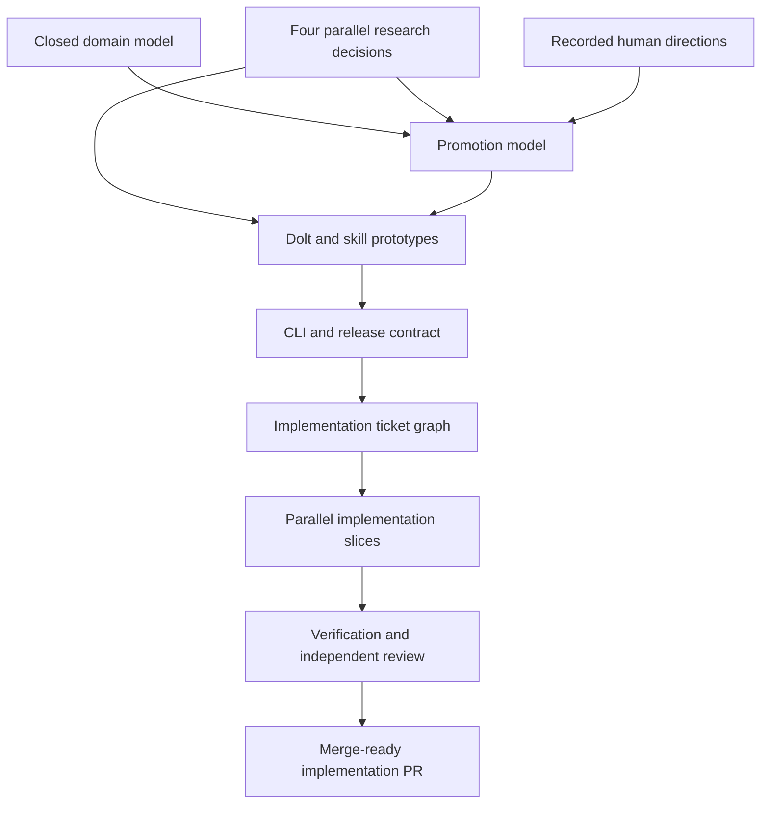

# Reasoning Ledger Wayfinder Path

**Map**: [Chart the greenfield Beadcrumbs reasoning ledger](beads:bdc-7ah)

**Design**:
[Beadcrumbs as a Repository-Local Reasoning Ledger](2026-08-27-reasoning-ledger-design.md)

**Plan**:
[Dolt Reasoning Ledger v1.0.0 Implementation Plan](2026-08-28-dolt-reasoning-ledger-v1-plan.md)

**Purpose**: Preserve the dependency path from the local stealth Beads map in
Git so another clone can recover the intended sequence without reconstructing
it from a conversation transcript.

The Beads map remains the live tracker while it is available. This document is
the portable path: update it whenever a decision closes, dependencies change,
or implementation tickets replace the planning fog.

## Destination

Reach a reviewed, merge-ready v1 implementation of the standalone
repository-local Dolt reasoning ledger specified in the design. The path is
complete when research and prototypes have resolved the risky seams, every
accepted behavior maps to an implementation ticket and verification path, and
the resulting implementation PR has passed standards, specification, and
adversarial review.

## Decision Path

All thirteen are closed. Each ticket carries one resolution comment; the four
research decisions also have a dated document in `docs/`.

| Decision | Kind | Status | Resolution artifact |
|---|---|---|---|
| [Choose the standalone Dolt operating model](beads:bdc-7ah.1) | Research | Closed | [Dolt operating model research](2026-08-28-dolt-operating-model-research.md) |
| [Choose portable skill installation and session integration](beads:bdc-7ah.2) | Research | Closed | [Portable skill install research](2026-08-28-portable-skill-install-research.md) |
| [Define the generic durable-knowledge destination model](beads:bdc-7ah.3) | Research | Closed | [Destination model research](2026-08-28-destination-model-research.md) |
| [Choose the optional Beads reference integration contract](beads:bdc-7ah.4) | Research | Closed | [Beads JSON contract research](2026-08-28-beads-json-contract-research.md) |
| [Define the Crumb-to-Insight domain model](beads:bdc-7ah.5) | Human decision | Closed | Ticket resolution comment |
| [Define evidence, confidence, validation, and authority](beads:bdc-7ah.6) | Human decision | Closed | Ticket resolution comment |
| [Define the tracker-neutral reference graph](beads:bdc-7ah.7) | Human decision | Closed | Ticket resolution comment |
| [Define harvesting privacy and retention policy](beads:bdc-7ah.8) | Human decision | Closed | Ticket resolution comment |
| [Define Promotion Proposals and receipts](beads:bdc-7ah.9) | Human decision | Closed | Ticket resolution comment |
| [Prototype the generic harvest-and-promote skill workflow](beads:bdc-7ah.10) | Prototype | Closed on paper | [Implementation plan](2026-08-28-dolt-reasoning-ledger-v1-plan.md) §4 |
| [Choose the Dolt schema and storage module interface](beads:bdc-7ah.11) | Prototype | Closed on paper | [Implementation plan](2026-08-28-dolt-reasoning-ledger-v1-plan.md) §1.2–1.3, §2 |
| [Define the first-release product and CLI interface](beads:bdc-7ah.12) | Human decision | Closed | [Implementation plan](2026-08-28-dolt-reasoning-ledger-v1-plan.md) §3 |
| [Define verification and release readiness](beads:bdc-7ah.13) | Human decision | Closed | [Implementation plan](2026-08-28-dolt-reasoning-ledger-v1-plan.md) §6 |

Neither prototype was built. The storage seam's risk was retired by the
executable proof behind the Dolt operating model decision, and the skill's
portable contract was settled by measurement of the installer and harness hook
surfaces. Both shapes are specified in the implementation plan, and the
executable proof is the release-gate tests each slice must pass.

## Traversal

## Implementation Tickets

Ten slices, all open, dependency-linked under the map. **File ownership is
exclusive**: a slice edits only the paths listed in its ticket, so slices in the
same parallel group can run in separate worktrees without touching the same
package. The schema is complete after the second slice and no later slice adds
DDL — that is what makes the parallelism safe.

| Slice | Ticket | Depends on | Mode |
|---|---|---|---|
| 1 | [Dolt repository lifecycle, stealth discovery, backup, restore, and doctor](beads:bdc-7ah.14) | — | serial |
| 2 | [Normalized schema and intent-based ledger storage operations](beads:bdc-7ah.15) | 1 | serial |
| 3 | [Crumb capture, provenance, confidence, review, and pruning](beads:bdc-7ah.16) | 2 | parallel A |
| 4 | [Tracker-neutral references and causal lineage](beads:bdc-7ah.17) | 2 | parallel A |
| 9 | [Optional Beads enrichment through supported bd --json](beads:bdc-7ah.22) | 2 | parallel A |
| 5 | [Harvest synthesis and Insight revision lifecycle](beads:bdc-7ah.18) | 3, 4 | serial |
| 6 | [Validation, authority, Promotion Proposals, attempts, and receipts](beads:bdc-7ah.19) | 5 | serial |
| 7 | [Stable JSON CLI plus context, handoff, and prime](beads:bdc-7ah.20) | 6, 9 | serial |
| 8 | [Portable Beadcrumbs skill and opt-in privacy-safe harvesting](beads:bdc-7ah.21) | 7 | serial |
| 10 | [Clean-break documentation, packaging, compatibility removal, and release verification](beads:bdc-7ah.23) | 8 | serial |

Parallel group A — Crumb capture, tracker-neutral references, and optional Beads
enrichment — is the only genuine three-way parallel opportunity: disjoint
packages, disjoint command files, no shared migration, no shared fixtures.
Everything else is serial because each slice reads the previous one's domain
types.

Deletions land in the final slice, together, so no intermediate commit has a
broken build. The exception is the prototype SQLite store and its shared types,
which the first two slices must remove immediately because they cannot coexist
with the new store under the same import path.

## Completion Rules

For each research or prototype decision:

1. Claim the named ticket before work.
2. Save the evidence or prototype result in the repository.
3. Record one resolution comment with the chosen direction and evidence link.
4. Close the ticket only when its completion criterion is met.
5. Add a linked one-line decision to the map.
6. Update the status in this document.

For each implementation ticket:

1. Map its acceptance criteria to tests or an observable runtime proof.
2. Implement in an isolated worktree from the approved implementation branch.
3. Commit one coherent behavioral slice.
4. Run the smallest relevant checks, then the full release gate before review.
5. Record blockers as dependencies instead of silently broadening scope.

The final implementation PR must disposition standards review, specification
review, and one adversarial pass. Merge, global installation, publication, and
release remain separate confirmation gates.
