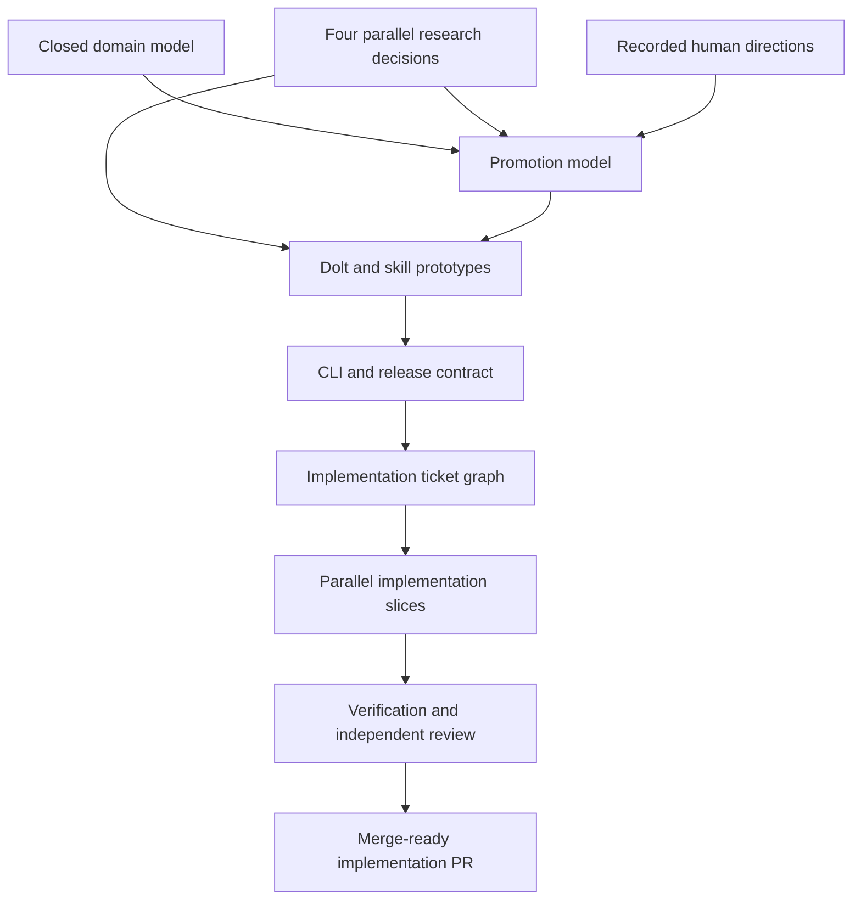

# Reasoning Ledger Wayfinder Path

**Map**: [Chart the greenfield Beadcrumbs reasoning ledger](beads:bdc-7ah)

**Design**:
[Beadcrumbs as a Repository-Local Reasoning Ledger](2026-08-27-reasoning-ledger-design.md)

**Purpose**: Preserve the dependency path from the local stealth Beads map in
Git so another clone can recover the intended sequence without reconstructing
it from a conversation transcript.

The Beads map remains the live tracker while it is available. This document is
the portable path: update it whenever a decision closes, dependencies change,
or implementation tickets replace the planning fog.

## Destination

Reach a reviewed, merge-ready v1 implementation of the standalone
repository-local Dolt reasoning ledger specified in the design. The path is
complete when research and prototypes have resolved the risky seams, every
accepted behavior maps to an implementation ticket and verification path, and
the resulting implementation PR has passed standards, specification, and
adversarial review.

## Decision Path

| Decision | Kind | Depends on | Status at publication |
|---|---|---|---|
| [Choose the standalone Dolt operating model](beads:bdc-7ah.1) | Research | Map | Open |
| [Choose portable skill installation and session integration](beads:bdc-7ah.2) | Research | Map | Open |
| [Define the generic durable-knowledge destination model](beads:bdc-7ah.3) | Research | Map | Open |
| [Choose the optional Beads reference integration contract](beads:bdc-7ah.4) | Research | Map | Open |
| [Define the Crumb-to-Insight domain model](beads:bdc-7ah.5) | Human decision | Map | Closed |
| [Define evidence, confidence, validation, and authority](beads:bdc-7ah.6) | Human decision | Map | Open; user direction recorded |
| [Define the tracker-neutral reference graph](beads:bdc-7ah.7) | Human decision | Map | Open; user direction recorded |
| [Define harvesting privacy and retention policy](beads:bdc-7ah.8) | Human decision | Map | Open; user direction recorded |
| [Define Promotion Proposals and receipts](beads:bdc-7ah.9) | Human decision | Destination model, domain model, evidence and authority | Blocked |
| [Prototype the generic harvest-and-promote skill workflow](beads:bdc-7ah.10) | Prototype | Skill research, domain model, evidence and authority, privacy, Promotions | Blocked |
| [Choose the Dolt schema and storage module interface](beads:bdc-7ah.11) | Prototype | Dolt research, domain model, evidence and authority, references, Promotions | Blocked |
| [Define the first-release product and CLI interface](beads:bdc-7ah.12) | Human decision | Beads contract, domain model, evidence and authority, references, privacy, both prototypes | Blocked |
| [Define verification and release readiness](beads:bdc-7ah.13) | Human decision | Dolt research, skill research, privacy, storage prototype, CLI | Blocked |

The user has already supplied direction for every open human decision. Read the
ticket comments and the approved design before asking another question.
Research choices still require current primary-source evidence, and prototypes
still require executable proof.

## Traversal

## Implementation Ticket Boundary

Once the decision path is resolved, replace the map's implementation fog with
dependency-linked tickets for these slices:

1. Dolt repository lifecycle, stealth discovery, backup, restore, and doctor.
2. Normalized schema and intent-based ledger storage operations.
3. Crumb capture, provenance, confidence, review, and pruning.
4. Tracker-neutral references and causal lineage.
5. Harvest synthesis and Insight revision lifecycle.
6. Validation, authority, Promotion Proposals, attempts, and receipts.
7. Stable JSON CLI plus context, handoff, and prime.
8. Portable Beadcrumbs skill and opt-in privacy-safe harvesting.
9. Optional Beads enrichment through supported `bd --json`.
10. Clean-break documentation, packaging, compatibility removal, and release
    verification.

Assign file ownership after the two prototypes establish module seams. Parallel
worktrees should not edit the same package or migration sequence.

## Completion Rules

For each research or prototype decision:

1. Claim the named ticket before work.
2. Save the evidence or prototype result in the repository.
3. Record one resolution comment with the chosen direction and evidence link.
4. Close the ticket only when its completion criterion is met.
5. Add a linked one-line decision to the map.
6. Update the status in this document.

For each implementation ticket:

1. Map its acceptance criteria to tests or an observable runtime proof.
2. Implement in an isolated worktree from the approved implementation branch.
3. Commit one coherent behavioral slice.
4. Run the smallest relevant checks, then the full release gate before review.
5. Record blockers as dependencies instead of silently broadening scope.

The final implementation PR must disposition standards review, specification
review, and one adversarial pass. Merge, global installation, publication, and
release remain separate confirmation gates.
